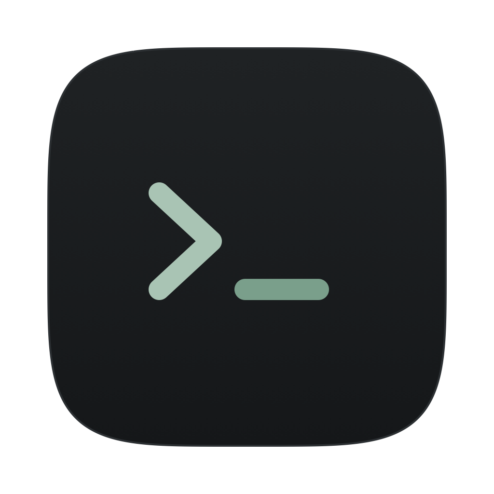

<p align="center">
  
</p>

<h1 align="center">Tily</h1>

<p align="center">
  Terminal macOS organisé en <strong>workspaces → onglets → panes</strong>, avec une interface compacte et un panneau en arborescence.
</p>

<p align="center">
  <a href="https://github.com/IKLSI/Tily/releases/latest"></a>
  
  <a href="LICENSE"></a>
</p>


## Fonctionnalités

- **Workspaces libres** : un panneau en arborescence, repliable et redimensionnable, regroupe les workspaces et leurs onglets. Tout se renomme directement sur place (un onglet renommé peut reprendre le nom de son dossier), les workspaces se réordonnent, les onglets se dupliquent et se déplacent d’un workspace à l’autre, et un onglet fermé par erreur se rouvre.
- **Vrais terminaux** : zsh par défaut avec votre profil habituel (`.zshrc`, alias et fonctions) ; bash au clic droit sur « + » ; taille du texte réglable dans Paramètres ou depuis la palette ; historique de défilement effaçable depuis le menu du terminal.
- **Splits** : plusieurs terminaux côte à côte ou l’un sous l’autre dans le même onglet, redimensionnables et navigables au clavier ; les égaliser, en échanger deux, sortir un terminal dans son propre onglet ou le ramener dans un autre onglet, sans jamais arrêter son processus.
- **Palette Ctrl + P** : retrouver une commande, un workspace, un onglet ou un terminal en quelques lettres.
- **Touche Leader Cmd + K** (ou Ctrl + Espace) : toutes les actions au clavier, sans gêner la saisie dans le terminal.
- **Sélecteur de projets** : ouvrir un nouveau workspace directement dans un dossier de projet ou dans l’un de ses worktrees, ou, par Maj + Entrée, un nouvel onglet du workspace actif.
- **Explorateur de fichiers** : parcourir le dossier du terminal actif dans un panneau à droite, avec l’état Git de chaque fichier (modifié, ajouté, non suivi…) et son diff à un clic droit, un bouton « Tout replier », et lire un fichier Markdown ou texte, voir une image ou une page HTML, dans un aperçu rechargé à chaque modification, rendu ou texte source pour le Markdown et le HTML, et modifier un fichier texte (Markdown, HTML, JSON, texte…) directement dans cet aperçu ; « Ouvrir un fichier du projet… » dans la palette retrouve un fichier du dépôt par son nom ou son chemin, les fichiers modifiés en tête, pour l’ouvrir dans l’éditeur ou dans l’aperçu, l’afficher dans l’arbre ou insérer son chemin dans le terminal.
- **Notes par workspace** : garder des notes en texte brut (tâches, ports, commandes) dans la vue « Notes » du panneau de droite, enregistrées avec la session ; Ctrl + Entrée colle la ligne du curseur dans le terminal actif et Ctrl + Maj + Entrée l’exécute ; une icône signale les workspaces qui en ont.
- **Journal des messages** : un clic sur la barre de statut, ou Ctrl + Maj + L, déplie l’historique horodaté de ses messages, conservé d’une session à l’autre.
- **Branche visible** : l’en-tête de chaque terminal affiche la branche Git de son dossier, mise à jour après chaque commande ; un clic dessus ouvre la vue Git.
- **Vue Git** : graphe de l’historique, branches et tags, Stage et commit, Push et Pull, Merge, Rebase, Cherry-pick, Revert, Stash, résolution des conflits et bouton « Annuler », sans taper de commande ; le diff d’un fichier se copie en un clic, prêt pour `git apply`, et le chemin relatif d’un fichier modifié depuis son menu, qui l’affiche aussi dans l’arbre des fichiers ; le brouillon du message de commit est gardé par dépôt ; fetch automatique à l’ouverture, désactivable dans les Paramètres.
- **Worktrees** : lister, ouvrir, créer et supprimer des worktrees Git comme avec `wtr` et `rmwt` (ports de développement libres, `pnpm install` dans le terminal du nouveau workspace, base PostgreSQL ou SQL Server répliquée), depuis la vue Git, la palette, Leader puis N ou l’icône d’arbre du panneau des workspaces ; quand un projet contient plusieurs dépôts Git, choisir celui à utiliser, et mémoriser par projet le dépôt par défaut et le dossier des worktrees.
- **Suivi de Claude Code** : repérer d’un coup d’œil le workspace et l’onglet où Claude Code travaille, attend une réponse ou a terminé ; une page HTML que Claude Code ouvre pour relecture (`open page.html`) s’affiche dans l’aperçu, à côté de son terminal, au lieu du navigateur. Ce suivi s’active par le bouton « Installer les hooks » de Paramètres → Agents, à cliquer de nouveau quand une mise à jour les annonce « non installés ».
- **Pilotage par Claude Code** : Claude Code, lancé dans un pane, lit lui-même la sortie des terminaux, retrouve les commandes en échec et attend qu’un serveur soit prêt, sans copier-coller de logs ; il ouvre aussi workspaces, onglets, splits et worktrees, et lance ou interrompt des commandes. Agir sur un terminal qu’il n’a pas créé, ou en fermer un, demande votre accord. Ce serveur MCP local s’active par le bouton « Activer » de Paramètres → Serveur MCP, avec effet aux prochaines sessions `claude`.
- **Navigateur intégré** : afficher l’application en cours de développement dans un pane, à côté de ses terminaux (Leader puis U, la palette ou clic droit sur « + »), avec Précédent, Recharger, largeur mobile ou desktop, DevTools et un compteur d’erreurs ; la connexion aux sites (Azure AD compris) est gardée d’un lancement à l’autre. Avec le serveur MCP de Tily activé, Claude Code y ouvre lui-même une page, lit sa console et ses requêtes en échec et en prend des captures desktop ou mobile.
- **Commandes longues** : quand une commande de plus de 10 secondes se termine dans un onglet que vous ne regardez pas (build, tests, installation), l’onglet porte une coche ou une croix rouge en cas d’échec, et la barre de statut l’annonce en citant la commande ; si Tily n’a pas le focus, son icône rebondit dans le Dock.
- **Sortie des commandes** : copier la sortie de la dernière commande (menu du terminal ou palette), pour la coller dans un agent, et passer d’une commande à l’autre dans l’historique par Alt + PgUp / PgDn (zsh).
- **Liens cliquables** : Ctrl + clic sur un lien affiché dans le terminal l’ouvre dans le navigateur ; Ctrl + clic sur un chemin de fichier (`src/app.ts:12:5`, `Program.cs(42,17)`) l’ouvre dans l’éditeur, à la bonne ligne avec VS Code et ses dérivés.
- **Glisser-déposer** : déposer un fichier ou un dossier du Finder, ou une ligne de l’arbre des fichiers de Tily, sur un terminal y insère son chemin.
- **Mises à jour intégrées** : Tily signale une nouvelle version dans son en-tête, affiche ses nouveautés et renvoie vers la page de téléchargement.
- **Session retrouvée** : workspaces, onglets, splits et texte des terminaux sont restaurés à la réouverture, avec l’avant-dernier enregistrement en secours si la session a été abîmée (coupure de courant) ; les préférences s’exportent et s’importent.

## Aperçu

### Palette Ctrl + P


### Vue Git


### Explorateur de fichiers


## Installation

1. Télécharger depuis la [dernière version](https://github.com/IKLSI/Tily/releases/latest) `Tily-x.y.z-arm64.dmg` (Mac à puce Apple) ou `Tily-x.y.z-x64.dmg` (Mac Intel).
2. Ouvrir le `.dmg` et glisser Tily dans Applications.
3. Tily n’est signé qu’ad hoc, sans notarisation : macOS le dit « endommagé » ou refuse de l’ouvrir tant que la quarantaine n’est pas retirée. Avant le premier lancement, exécuter dans un terminal :

   ```bash
   xattr -cr /Applications/Tily.app
   ```

La touche Leader est Cmd + K. Ctrl + Espace fonctionne aussi, mais macOS le réserve par défaut au changement de source de saisie : il ne marche qu’après avoir libéré ce raccourci dans Réglages Système → Clavier → Raccourcis clavier → Sources de saisie. Placer un fichier dans la Corbeille depuis Tily demande une fois l’autorisation de piloter le Finder.

Tily vérifie lui-même les nouvelles versions (au démarrage puis toutes les 6 heures, désactivable dans Paramètres) et affiche leurs nouveautés ; « Installer et redémarrer » télécharge le nouveau `.dmg` (empreinte SHA-256 vérifiée), ferme Tily, remplace l’application et la relance, sans nouvelle confirmation de Gatekeeper : workspaces et préférences, rangés dans `~/Library/Application Support/Tily`, sont conservés.

## Construction

Sur un Mac, avec .NET 10, Node 24 et pnpm 12 :

```bash
dotnet test backend/Tily.slnx                       # hôte, bibliothèque et tests
cd desktop/renderer && pnpm install && pnpm build   # interface
cd .. && pnpm install && pnpm start                 # lance Tily en développement
scripts/build-mac.sh                                # paquets desktop/release/Tily-x.y.z-arm64.dmg et -x64.dmg
```

## Raccourcis clavier

| Leader (Cmd + K, puis…) | Raccourci direct | Action |
| --- | --- | --- |
| P | Ctrl + P | Palette |
| T | Ctrl + Maj + T | Nouvel onglet |
| V | Ctrl + Maj + D | Split côte à côte |
| H | Ctrl + Maj + H | Split haut/bas |
| F | — | Sélecteur de projets |
| N | — | Créer un worktree |
| W | Ctrl + Maj + W | Nouveau workspace |
| X | Ctrl + Maj + X | Fermer le terminal actif |
| M | Ctrl + Maj + M | Agrandir / réduire le terminal actif (ou double-clic sur son en-tête) |
| = | — | Donner la même place à chaque terminal de l’onglet actif (aussi dans la palette) |
| Maj + flèche | — | Échanger le terminal actif avec son voisin (aussi dans la palette) |
| ! | — | Déplacer le terminal actif dans un nouvel onglet, sans l’arrêter (aussi dans la palette et le menu du terminal) |
| E | Ctrl + Maj + E | Explorateur de fichiers |
| G | Ctrl + Maj + G | Vue Git |
| O | Ctrl + Maj + O | Notes du workspace |
| L | Ctrl + Maj + L | Journal de la barre de statut |
| B | Ctrl + Maj + B | Afficher / masquer les workspaces |
| Z | Ctrl + Maj + Z | Rouvrir le dernier onglet fermé |
| A | Ctrl + Maj + A | Rejoindre l’agent Claude Code en attente depuis le plus longtemps |
| , | — | Paramètres |
| Flèche | Alt + flèche | Passer d’un terminal à l’autre |
| — | Alt + PgUp / PgDn | Remonter ou descendre d’une commande dans l’historique du terminal (zsh) |
| Pg préc. / Pg suiv. | Ctrl + Maj + Pg préc. / Pg suiv. | Déplacer l’onglet vers la gauche / la droite |
| 1 … 9 | — | Aller à l’onglet 1 à 8 du workspace, 9 pour le dernier |
| — | Ctrl + Tab / Ctrl + Maj + Tab | Onglet suivant / précédent |

Ctrl + Maj + C et Ctrl + Maj + V copient et collent ; un texte de plusieurs lignes, que le shell exécuterait ligne à ligne, demande d’abord confirmation. Un clic droit, ou la touche Menu, ouvre le menu d’un terminal, d’un onglet, d’un workspace ou d’un fichier. Dans le panneau des workspaces, où Ctrl + Maj + B amène le focus quand il l’affiche et d’où Échap le rend au terminal, ↑ et ↓ passent d’une ligne à l’autre, → et ← déplient et replient, F2 renomme et Alt + ↑ / ↓ déplace la ligne. Dans la barre d’onglets, ← et → déplacent le focus d’un onglet à l’autre sans l’afficher (Entrée l’affiche), F2 renomme et Alt + ← / → déplace l’onglet. Dans le panneau des workspaces comme dans l’arbre des fichiers, taper les premières lettres d’un nom y amène. Dans l’arbre des fichiers, Ctrl + C copie le chemin de la ligne sélectionnée, Ctrl + Maj + C son chemin relatif, et F5 actualise, comme dans la vue Git. Un double-clic dans l’espace vide de la barre d’onglets ouvre un nouvel onglet. Dans la vue Git, F5 actualise ; dans le message de commit, Ctrl + Entrée commite et Ctrl + Maj + Entrée commite puis pousse.

## Licence

Copyright (c) 2026 Maxime Razafinjato  
Copyright (c) 2026 KLS

Tily est un logiciel libre distribué sous licence [GNU GPL v3](LICENSE) : chacun peut l’utiliser, l’étudier, le modifier et le redistribuer, à condition que toute version redistribuée reste sous la même licence.
