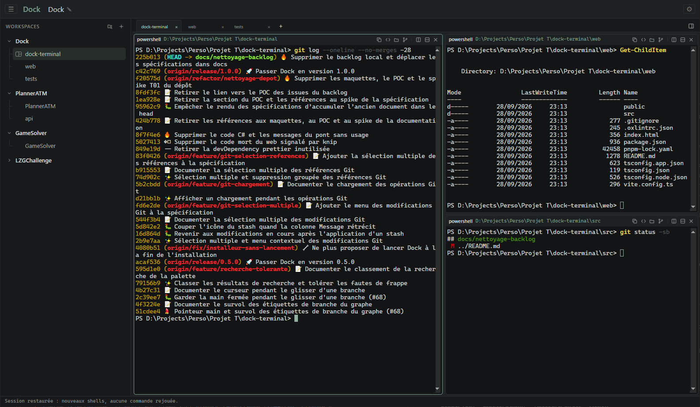
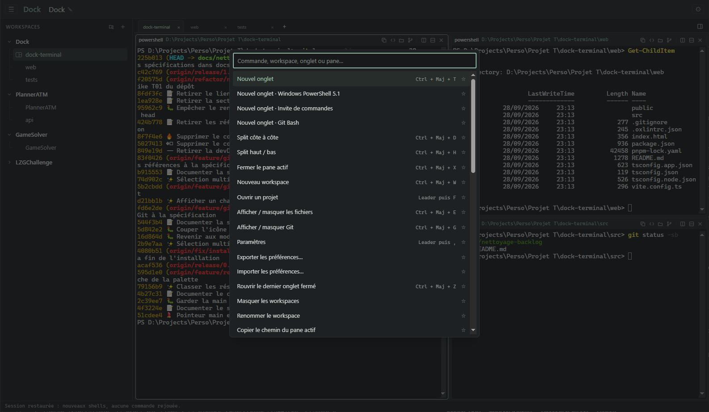
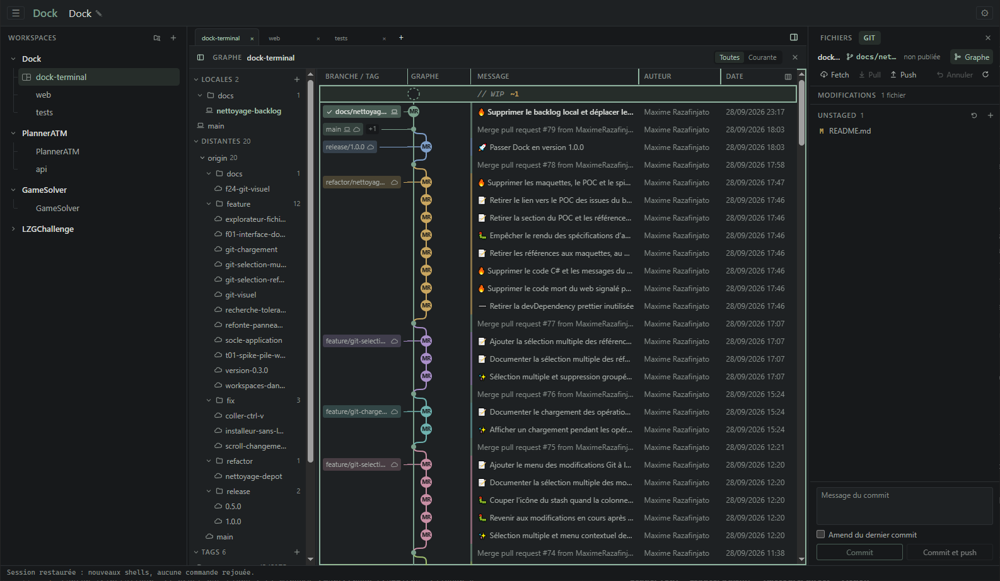
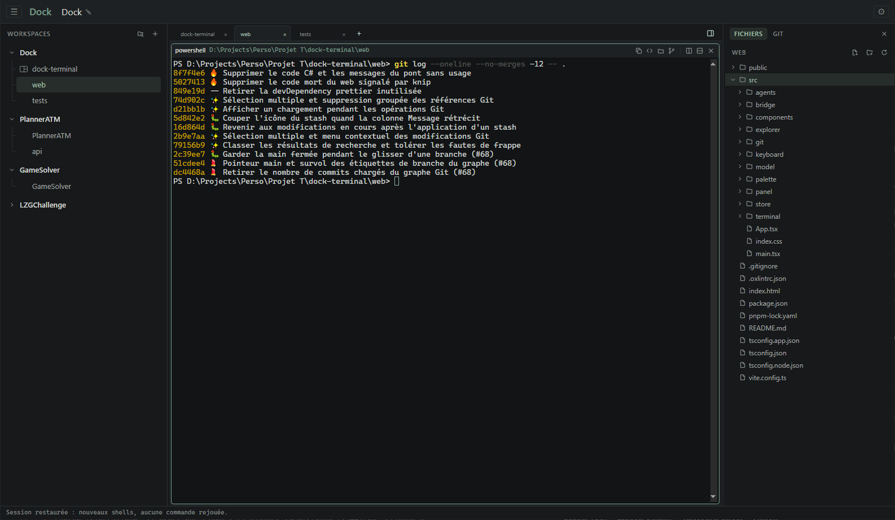

  

<h1 align="center">Dock Terminal</h1>

  Terminal Windows organisé en <strong>workspaces → onglets → panes</strong>, avec une interface compacte et un panneau en arborescence.

  
  

## Fonctionnalités

- **Workspaces libres** : un panneau en arborescence, repliable et redimensionnable, regroupe les workspaces et leurs onglets. Tout se renomme directement sur place, les workspaces se réordonnent, les onglets se dupliquent et se déplacent d’un workspace à l’autre, et un onglet fermé par erreur se rouvre.
- **Vrais terminaux** : Windows PowerShell par défaut avec votre profil habituel, ses alias et ses fonctions ; PowerShell 7, CMD et Git Bash au clic droit sur « + ».
- **Splits** : plusieurs terminaux côte à côte ou l’un sous l’autre dans le même onglet, redimensionnables et navigables au clavier.
- **Palette Ctrl + P** : retrouver une commande, un workspace, un onglet ou un terminal en quelques lettres.
- **Touche Leader Ctrl + Espace** : toutes les actions au clavier, sans gêner la saisie dans le terminal.
- **Sélecteur de projets** : ouvrir un nouveau workspace directement dans un dossier de projet ou dans l’un de ses worktrees.
- **Explorateur de fichiers** : parcourir le dossier du terminal actif dans un panneau à droite, et lire un fichier Markdown ou texte dans un aperçu rendu, rechargé à chaque modification.
- **Notes par workspace** : garder des notes en texte brut (tâches, ports, commandes) dans la vue « Notes » du panneau de droite, enregistrées avec la session ; une icône signale les workspaces qui en ont.
- **Journal des messages** : un clic sur la barre de statut, ou Ctrl + Maj + L, déplie l’historique horodaté de ses messages, conservé d’une session à l’autre.
- **Branche visible** : l’en-tête de chaque terminal affiche la branche Git de son dossier, mise à jour après chaque commande.
- **Vue Git** : graphe de l’historique, branches et tags, Stage et commit, Push et Pull, Merge, Rebase, Stash, résolution des conflits et bouton « Annuler », sans taper de commande ; fetch automatique à l’ouverture, désactivable dans les Paramètres.
- **Worktrees** : lister, ouvrir, créer et supprimer des worktrees Git comme avec `wtr` et `rmwt` (ports de développement libres, `pnpm install` dans le terminal du nouveau workspace, base PostgreSQL ou SQL Server répliquée), depuis la vue Git, la palette, Leader puis N ou l’icône d’arbre du panneau des workspaces.
- **Suivi de Claude Code** : repérer d’un coup d’œil le workspace et l’onglet où Claude Code travaille, attend une réponse ou a terminé.
- **Liens cliquables** : Ctrl + clic sur un lien affiché dans le terminal l’ouvre dans le navigateur.
- **Glisser-déposer** : déposer un fichier ou un dossier de l’Explorateur Windows, ou une ligne de l’arbre des fichiers de Dock, sur un terminal y insère son chemin.
- **Mises à jour intégrées** : Dock signale une nouvelle version dans son en-tête, affiche ses nouveautés et l’installe en un clic avant de redémarrer.
- **Session retrouvée** : workspaces, onglets, splits et texte des terminaux sont restaurés à la réouverture ; les préférences s’exportent et s’importent.

## Aperçu

### Palette Ctrl + P

### Vue Git

### Explorateur de fichiers

## Installation

1. Télécharger `Dock-x.y.z-setup.exe` depuis la [dernière version](https://github.com/MaximeRazafinjato/dock-terminal/releases/latest).
2. Lancer l’installeur. Il n’est pas signé : si Windows SmartScreen s’affiche, cliquer « Informations complémentaires » puis « Exécuter quand même ».

Aucun droit administrateur n’est nécessaire. Dock vérifie ensuite lui-même les nouvelles versions (au démarrage puis toutes les 6 heures, désactivable dans Paramètres) : le bouton « Mise à jour » de l’en-tête installe la nouvelle version et redémarre Dock, workspaces et préférences conservés. Lancer à la main le nouvel installeur, Dock fermé, reste possible.

## Raccourcis clavier

| Leader (Ctrl + Espace, puis…) | Raccourci direct | Action |
| --- | --- | --- |
| P | Ctrl + P | Palette |
| T | Ctrl + Maj + T | Nouvel onglet |
| V | Ctrl + Maj + D | Split côte à côte |
| H | Ctrl + Maj + H | Split haut/bas |
| F | — | Sélecteur de projets |
| N | — | Créer un worktree |
| W | Ctrl + Maj + W | Nouveau workspace |
| X | Ctrl + Maj + X | Fermer le terminal actif |
| M | Ctrl + Maj + M | Agrandir / réduire le terminal actif (ou double-clic sur son en-tête) |
| E | Ctrl + Maj + E | Explorateur de fichiers |
| G | Ctrl + Maj + G | Vue Git |
| O | Ctrl + Maj + O | Notes du workspace |
| L | Ctrl + Maj + L | Journal de la barre de statut |
| B | Ctrl + Maj + B | Afficher / masquer les workspaces |
| Z | Ctrl + Maj + Z | Rouvrir le dernier onglet fermé |
| A | Ctrl + Maj + A | Rejoindre l’agent Claude Code en attente depuis le plus longtemps |
| , | — | Paramètres |
| Flèche | Alt + flèche | Passer d’un terminal à l’autre |
| Pg préc. / Pg suiv. | Ctrl + Maj + Pg préc. / Pg suiv. | Déplacer l’onglet vers la gauche / la droite |
| — | Ctrl + Tab / Ctrl + Maj + Tab | Onglet suivant / précédent |

Ctrl + Maj + C et Ctrl + Maj + V copient et collent. Un clic droit, ou la touche Menu, ouvre le menu d’un terminal, d’un onglet, d’un workspace ou d’un fichier. Dans le panneau des workspaces, où Ctrl + Maj + B amène le focus quand il l’affiche et d’où Échap le rend au terminal, ↑ et ↓ passent d’une ligne à l’autre, → et ← déplient et replient, F2 renomme et Alt + ↑ / ↓ déplace la ligne. Dans la barre d’onglets, ← et → déplacent le focus d’un onglet à l’autre sans l’afficher (Entrée l’affiche), F2 renomme et Alt + ← / → déplace l’onglet. Dans le panneau des workspaces comme dans l’arbre des fichiers, taper les premières lettres d’un nom y amène.
